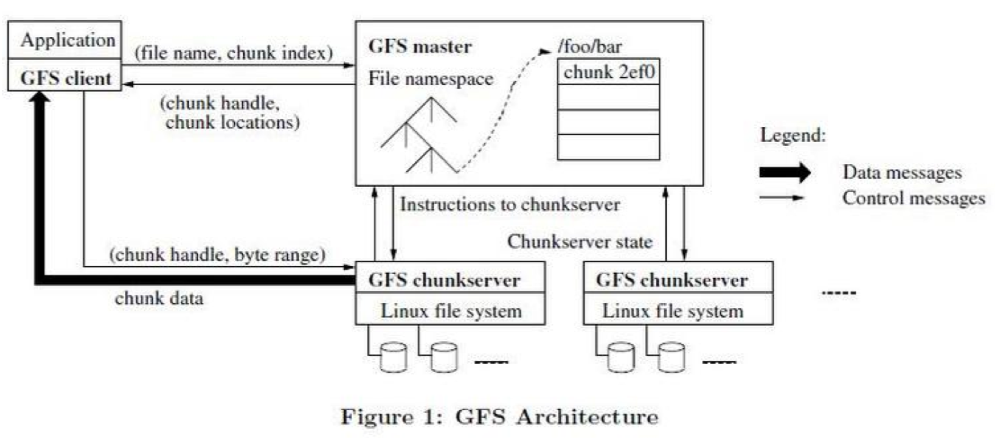

### GFS的设计目标

分布式文件系统的共同设计目标:
* 性能
* 可伸缩性
* 可靠性
* 可用性

GFS根据自己情况重新设计的目标:

* 组件失效是常态事件，而不是意外事件，因此要有持续的监控、错误侦测、灾难冗余、自动恢复等机制
* 不能以管理大文件的方式来管理小文件，所以IO操作和Block的尺寸都需要重新考虑
* 数据的追加操作是性能优化和原子性保证的主要考量因素
* 应用程序和文件系统API协同设计，提高整个系统的灵活性(放宽对GFS一致性模型的要求)
* 支持小规模的随机写入，但是可能效率不佳
* 小规模的随机读会被合并并排序，之后按顺序批量读取，避免在文件中前后来回移动读取位置
* 高性能的稳定带宽远比低延迟重要

### GFS架构

整个GFS的架构包含了一个单独的Master节点， 多个chunk服务器，GFS存储的文件会被分割成固定大小的chunk，每一个chunk都会被分配一个全球唯一的64位标识。
然后以Linux文件的形式保存在本地硬盘上。出于可靠性的考虑，文件的每个块都会复制到多个chunk服务器上。Master节点管理所有的文件系统元数据。这些元数据包含了名字
空间、访问控制信息、文件和Chunk的映射信息、以及当前Chunk的位置信息。GFS的客户端代码以库的形式被链接到客户程序里。客户端代码实现了GFS文件系统的API接口函数、
应用程序与Master节点和Chunk服务器通讯、以及对数据进行读写操作。无论是客户端还是Chunk服务器都不需要缓存文件数据。客户端缓存数据几乎没有什么用处，因为大部分程序
要以流的方式读取一个巨大文件。要么工作集太大根本无法被缓存。无需考虑缓存相关的文件也简化了客户端和整个系统的设计与实现。

### 单一master的设计
虽然简化了设计，但是Master节点缺成为了系统的瓶颈，为此需要减少对Master节点的负载，通过选择合适的chunk大小尺寸可以有效的减少和master节点的网络通讯，较大的chunk尺寸
使得master节点需要维护的元数据信息变少。GFS客户端只有在第一次获取元数据信息的时候才会访问Master节点，此后都是直接跟chunk服务器打交道。所以Master节点唯一的瓶颈
是在内存上的，相对而言可以轻松的进行扩展。同时减少元数据信息的大小也是一种有效的手段，GFS中一条元数据信息大约只需要不到64字节的信息。通过这些手段可以使得Master节点将
所有的元数据信息都保存在内存中，增强了系统的简洁性、可靠性、高性能和灵活性。借助操作日志来记录数据的变更，对操作日志进行回放就可以恢复Master节点的状态。

> 较大的chunk尺寸虽然使得master节点要维护的元数据信息变少，但是带来的问题就是小文件容易存在热点，因为小文件通常只包含一个chunk。

### Append Only语义

### 租约机制

### 快照机制

### 过期失效的副本检测

### 垃圾回收

### 读流程
客户端把文件名和程序指定的字节偏移，根据固定的Chunk大小，转换成Chunk索引。然后，它把文件名和Chunk
索引发送给Master节点，Master节点将相应的Chunk标识和副本的位置信息发送给客户端。客户端用文件名和
Chunk索引作为key缓存这些信息。之后客户端将读请求发送到其中的一个副本处(一般选择最近的)。请求信息中
包含了Chunk的标识和字节范围。

### 写流程
1. 客户机向Master节点询问哪一个Chunk服务端持有当前的租约，以及其它副本的位置，如果没有一个Chunk持有租约，Master节点就选择其中一个副本建立租约
2. Master节点将主Chunk的标识符以及其它副本的位置返回给客户机。客户机缓存这些数据以便后续的操作。只有在主Chunk不可用，或者主Chunk回复信息表明它不再持有租约
的时候，客户机才需要重新跟Master节点联系。
3. 客户机把数据推送到所有的副本上，客户机可以以任意的顺序推送数据，Chunk服务器接收到数据并保存到它内部的LRU缓存中，一直到数据被使用或者过期交换出去。
4. 当所有的副本都被确认接收到数据，客户机发送写请求到主Chunk服务器。这个请求标识了早前推送到所有副本的数据。主Chunk为接收到所有操作分配连续的序列号，这些操作可能
来自不同的客户机，序列号保证了操作顺序执行。它以序列号的顺序把操作应用到它自己的本地状态中。
5. 主Chunk把写请求传递到所有的二级副本。每个二级副本依照主Chunk分配的 序列号以相同的顺序执行这些操作。
6. 所有的二级副本回复主Chunk，它们已经完成了操作。
7. 主Chunk 服务器回复客户机。任何副本产生的任何错误都会返回给客户机。在出现错误的情况下，写入操作可能在主Chunk和一些二级副本执行成功。(如果操作在主Chunk上失败了
操作就不会被分配序列号，也不会被传递。)客户端的请求被确认为失败，被修改的区域处于不一致的状态。我们的客户机代码通过重复执行失败的操作来处理这样的错误。

### 总结

1. 分布式系统的设计目标   性能、可伸缩性、可靠性、可用性等。
2. 组件失效时常态，必须将持续的监控、错误侦测、灾难冗余、自动恢复的机制集成到GFS中。
3. 确定是管理小文件还是大文件，要根据管理的对象大小设计Block的尺寸，IO操作等。
4. Append Only，海量文件的访问模式，客户端对数据块缓存是没有意义的。
5. 文件以chunk方式组织，并分配chunk标识，每个chunk被复制多份。
6. 单一master节点设计、减少对master节点的读写，避免master节点成为系统瓶颈。
7. Chunk大小的设计，减少对master节点的通讯开销，元数据可以全部放在内存中，其次客户端可以轻松缓存大量的Chunk信息。
8. 只有Chunk服务器才能最终确定一个chunk是否在它的硬盘上，所以没必要在master上持久化这些信息
9. 操作日志保存元数据的变更历史记录，可用于灾难恢复、批量操作等
10. 租约机制来保证多个副本的变更顺序一致性
11. 单一master，简化设计，使用快速恢复和复制来保证可用性
12. 客户端缓存数据几乎没有什么用处，因为大部分 程序要么以流的方式读取一个巨大文件，要么工作集太大根本无法被缓存。
    无需考虑缓存相关的问题也简化了客户端和整个系统的设计和实现，客户端只缓存元数据信息。
13. 通过增加副本的个数来对热点的读请求进行负载均衡，避免局部过载。
14. 通过命名空间锁保证文件的创建和删除等是原子的。

### 问题
1. GFS怎么处理并行写入? 加锁? 类似于Linux下的文件Append?
2. GFS中的Append Only是怎么实现的? 和Linux下的文件Append一致? 夸Chunk的时候怎么处理?